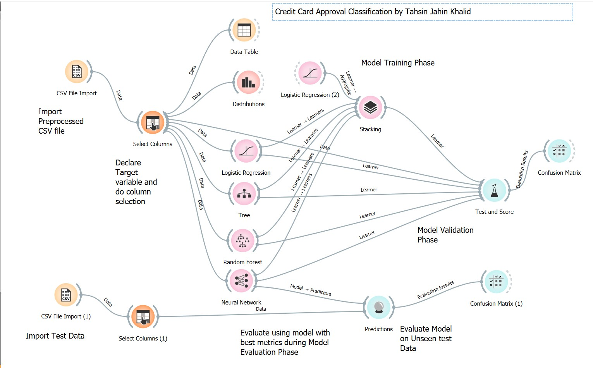
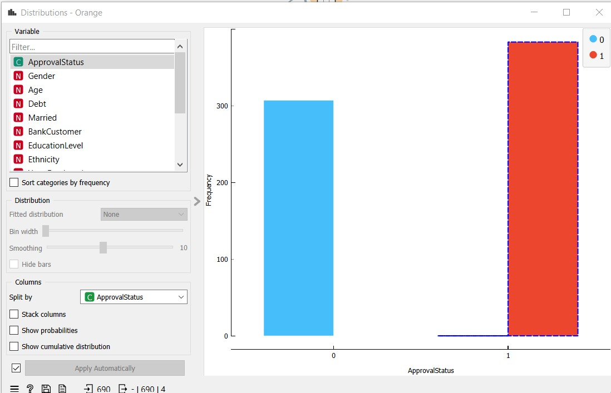
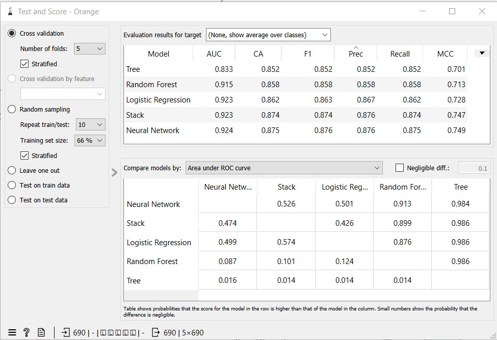
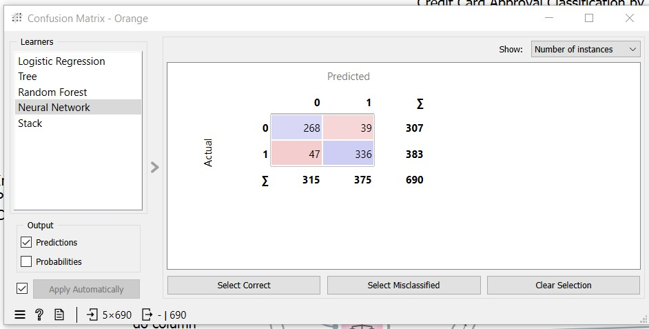
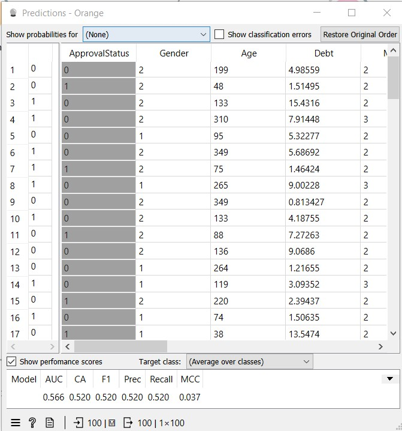
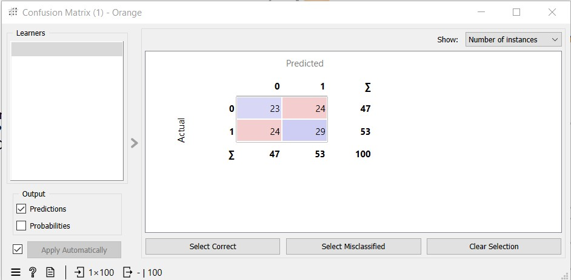

# Credit Card Approval Classification
## By: Tahsin Jahin Khalid
This is a machine learning project that analyzes the Kaggle Dataset and does a classification task of determining whether a credit card is approved or not.

### Technology Used:
- Python (for Data Preprocessing)
- Orange Data Mining

### Dataset
- [Kaggle - Credit Card Approval](https://www.kaggle.com/datasets/youssefaboelwafa/credit-card-approval/)
- GPT4 (test data generation)

#### About Dataset
Commercial banks receive a lot of applications for credit cards. Many of them get rejected for many reasons, like high loan balances, low income levels, or too many inquiries on an individual's credit report, for example. Manually analyzing these applications is mundane, error-prone, and time-consuming.

### About Project

### Orange Data Mining Workflow

### Project Summary
1. The preprocessed/cleaned data CSV file is loaded visa the `CSV File Import` widget.

2. A `Select Columns` widget is used to designate the "ApprovalStatus" variable as the target variable. The "Unnamed: 0" column is added to the ignore columns field. 

3. We use a `Distributions` widget to visualise the target variable to check if there is any imbalance.
   - 

4. The stage is training and validating various models on the datasert for classification. For this project we have used logistic regression, decision tree, random forest, neural network and a stacked model of these for comparison.

5. The metrics of the model (`Test and Score` widget) are shown below:
   
   - From these metrics, it can be seen that:
     - Out of the five models used, the stacked model and the neural network models have performed better than the baseline logistic regression model.
     - Comparing between the stacked model and the neural network, the neural nerwork (NN) model has performed marginally better in classification
     - The confusion Matrix of the NN model on training/validation data is shown below:
     - 

6. GPT4 is used to generate synthetic testing data to test the performance of the model on unseen data.

7. The NN model is used to make predictions on the unseen test data.
   - 
   - The AUC on testing data is `0.566`, and the Classification Accuracy is `52%`.
   - 
   - Inspecting the confusion matrix, the model's performance on test data is not optimal.
